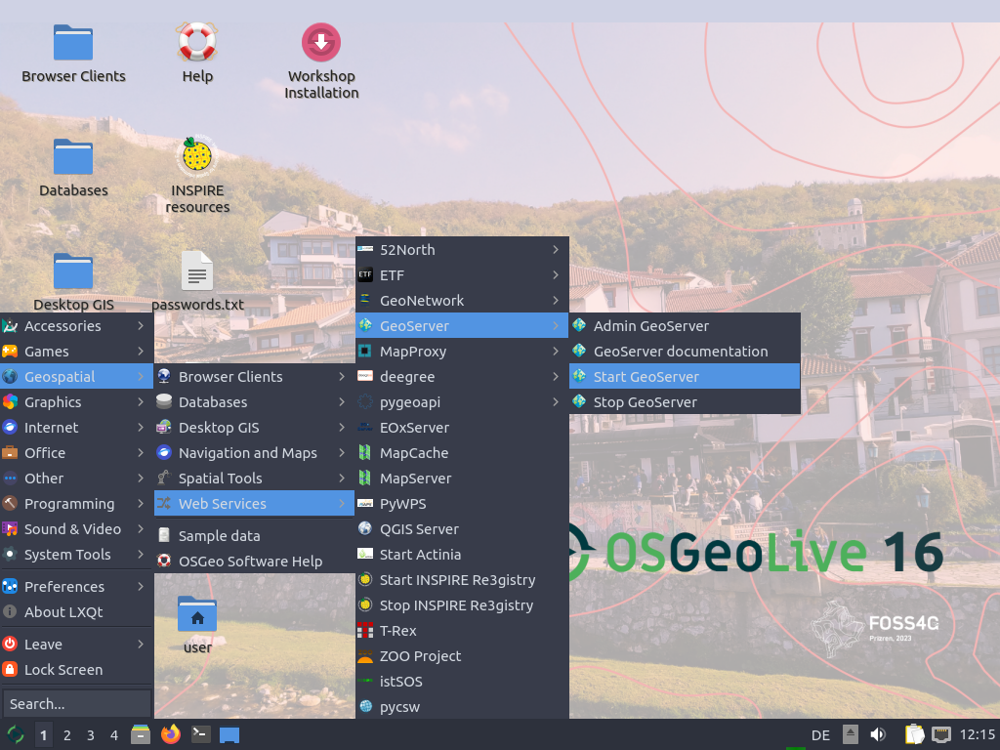
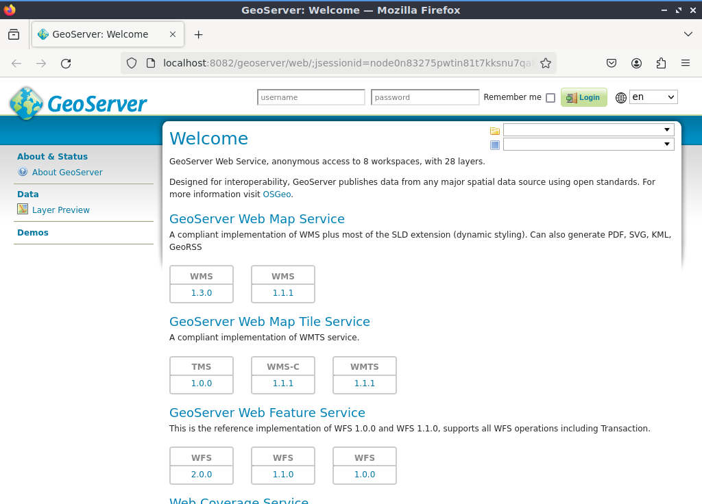

# Workshop-Start

Bevor wir starten, bitte folgende Schritte durchführen:

- Rechner mit OSGeoLive starten  
- Sprache: Deutsch (Tastaturbelegung)  
- *Lubuntu ohne Installation ausprobieren*  
- Benutzer: `user`, Passwort: `user`


---

## GeoServer starten & Zugangsdaten

- GeoServer: {{ book.geoServerBaseUrl }}
- Benutzer: <code>{{ book.geoServerUser }}</code>  
- Passwort: <code>{{ book.geoServerPassword }}</code>  
- Pfad im Dateisystem: <code>{{ book.geoServerPhysicalPath }}</code>

**Start:**  
Klicken Sie im Menü auf **Start GeoServer**



---

## Oberfläche & Fehlerbehebung

Nach dem Start öffnet sich GeoServer im Browser:



> ℹ️ **Falls der Start nicht funktioniert:**  
> Terminal öffnen und ausführen:
> ```bash
> sudo /usr/local/lib/geoserver/bin/startup.sh
> ```
> Terminal muss geöffnet bleiben!

Weiter geht's im Abschnitt:  
[GeoServer-Basiswissen](../basics/README.md)
