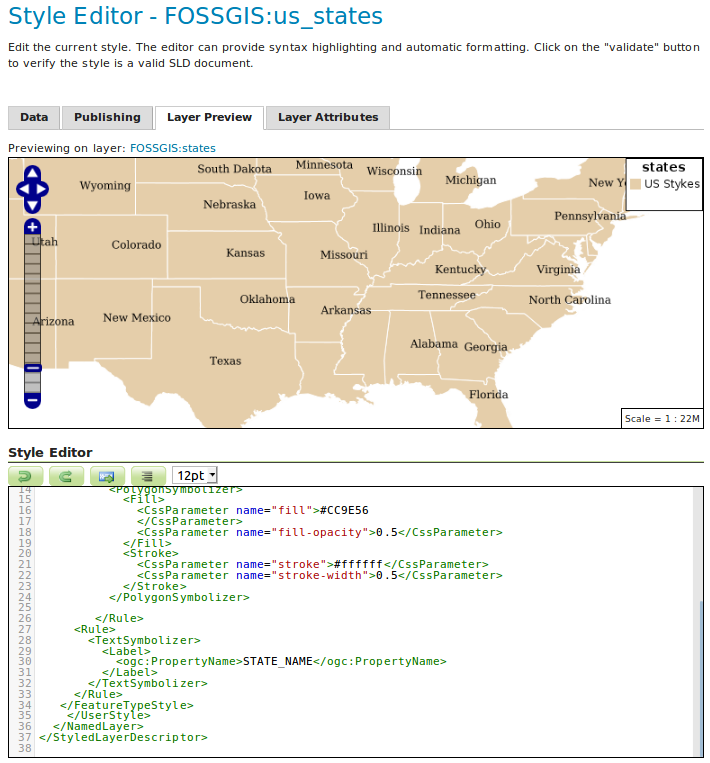

# Einführung in SLD

GeoServer unterstützt mehrere Style-Formate:  
**SLD, CSS, YSLD, MBStyle**

📘 **SLD (Styled Layer Descriptor)**  
Ein OGC-Standard zur Definition der visuellen Darstellung von Geodaten:

- XML-basiert
- Unterstützt Punkte, Linien, Polygone, Raster
- Definiert Farben, Transparenz, Linienbreiten usw.

[SLD-Referenz](https://docs.geoserver.org/stable/en/user/styling/sld/reference/index.html#sld-reference)

---

# SLD: Schlüsselkomponenten

- **XML-Syntax:** strukturierte Definition von Styles
- **Layer-Zuordnung:** Style ↔ FeatureType
- **Hierarchien:** mehrere Regeln für einen Layer
- **Symbolizer:** Punkte, Linien, Polygone, Raster
- **Filter & Regeln:** Styling nach Attributwerten
- **Zoom-Abhängigkeit:** Styles je nach Maßstab

➡️ Hohe Kontrolle über Karten-Darstellung

---

# Unterstützte Datentypen

Mit SLD können Sie stylen:

- 🟡 **Punkte** (z. B. Städte, POIs)  
- 🔵 **Linien** (z. B. Flüsse, Straßen)  
- 🟢 **Polygone** (z. B. Gebiete, Grenzen)  
- 🖼️ **Raster** (DEM, Luftbilder)  
- 📝 **Textlabels**  
- ⚙️ **Komplexe Daten** (Kombis & Operationen)

Die Unterstützung variiert je nach GeoServer-Version.

---

# Übungen & Beispiele

1. **Eigener Style für US-States**  
   - Flächen einfärben (50 % transparent)  
   - Umriss einfärben  
   - Name des Bundesstaats anzeigen

2. **Label erst ab Maßstab > 1:10 Mio**

3. **Bonus:** Einfärben nach Bevölkerungsanzahl

🔗 Lösungen:  
[Aufgabe 1](../assets/style-example-1.sld),  
[Aufgabe 2](../assets/style-example-2.sld),  
[Aufgabe 3A](../assets/style-example-3a.sld),  
[Aufgabe 3B](../assets/style-example-3b.sld)
