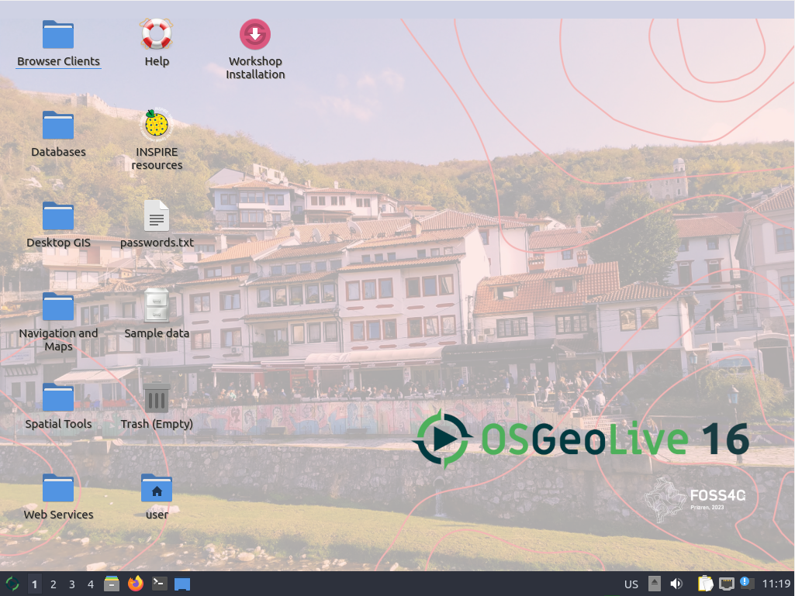
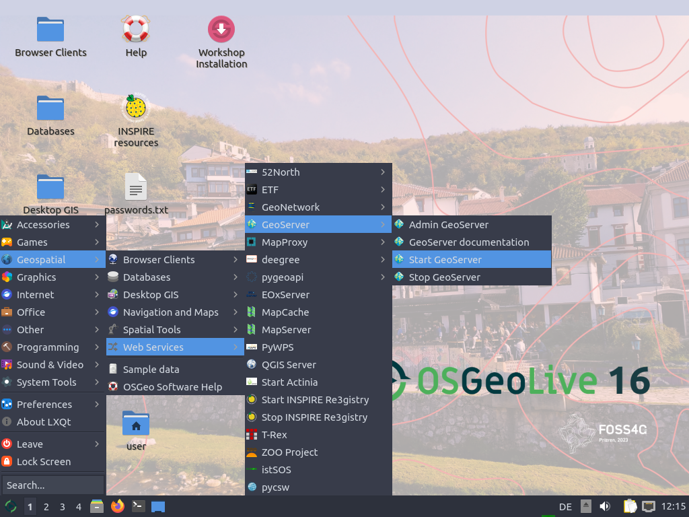
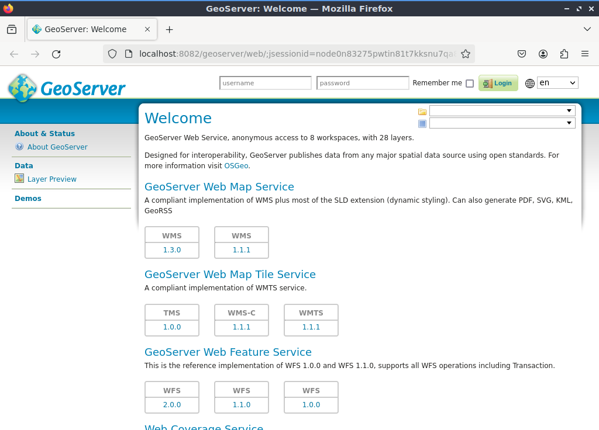
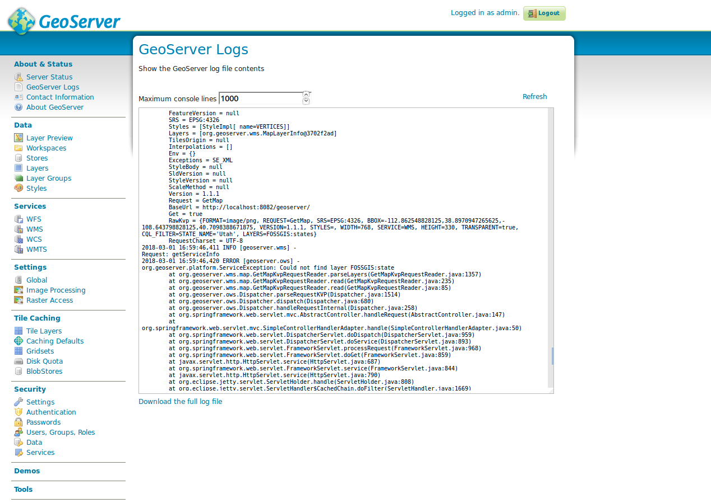
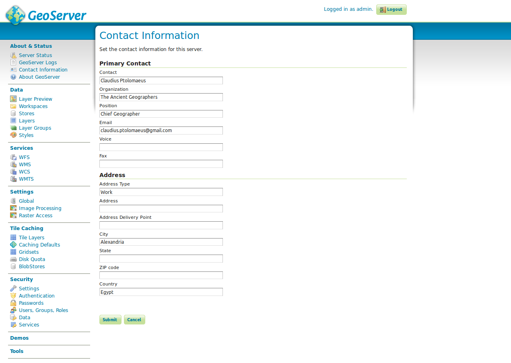
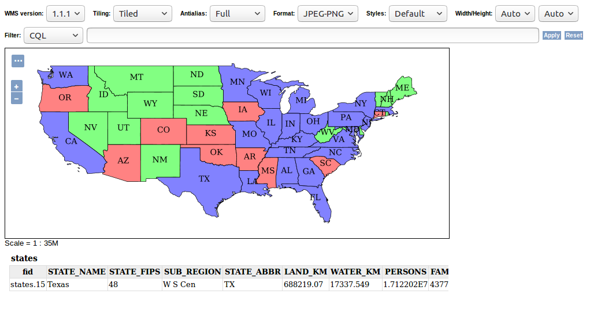

# Einführung in GeoServer

Willkommen zum **Einführung in GeoServer** Workshop.

Dieser Workshop wurde für [OSGeo-Live {{ book.osGeoLiveVersion }}](https://live.osgeo.org) entwickelt und bietet einen umfassenden Überblick über GeoServer als Web-Mapping-Lösung.


---

> ℹ️ **Information**  
> Der Workshop kann [als PDF](../{{ book.workshopPdfNameDe }}) heruntergeladen werden.

Bitte führen Sie zuerst die Schritte auf der Seite  
[Vorarbeiten und generelle Informationen](environment/README.md) aus,  
um einen reibungslosen Ablauf zu gewährleisten.


---
## Module im Workshop

- **Vorarbeiten und generelle Informationen**  
  OSGeoLive, Pfade, URLs, Zugangsdaten

- **Basiswissen GeoServer**  
  Einführung und Architektur

- **Administrationsoberfläche**  
  Konfiguration via Web-GUI

- **Datenveröffentlichung**  
  Vektor-/Rasterquellen, WFS/WMS

- **Gruppenlayer**  
  Kombinierte Layer als Einheit

- **Styling**  
  SLD-basierte Darstellung


---
<!-- _header: 'Rasterdatenquellen' -->
# Übersicht der Module

- Einführung  
- Vorarbeiten und generelle Informationen  
- Basiswissen GeoServer  
- Administrationsoberfläche  
  - Serverstatus  
  - Daten  
  - Einstellungen und Sicherheit

---

- Datenveröffentlichung  
  - Vektordatenquellen  
    - Shapefile  
    - PostGIS  
    - WFS  
  - Rasterdatenquellen  
    - GeoTIFF  
    - ImageMosaic  
    - WMS

---

- Gruppenlayer  
- Styling  
  - SLD  
    - Schlüsselelemente  
    - Unterstützte Datentypen
---

# Workshop-Start

Bevor wir starten, bitte folgende Schritte durchführen:

- Rechner mit OSGeoLive starten  
- Sprache: Deutsch (Tastaturbelegung)  
- *Lubuntu ohne Installation ausprobieren*  
- Benutzer: `user`, Passwort: `user`



---

## GeoServer starten & Zugangsdaten

- GeoServer: {{ book.geoServerBaseUrl }}
- Benutzer: <code>{{ book.geoServerUser }}</code>  
- Passwort: <code>{{ book.geoServerPassword }}</code>  
- Pfad im Dateisystem: <code>{{ book.geoServerPhysicalPath }}</code>

**Start:**  
Klicken Sie im Menü auf **Start GeoServer**



---

## Oberfläche & Fehlerbehebung

Nach dem Start öffnet sich GeoServer im Browser:



> ℹ️ **Falls der Start nicht funktioniert:**  
> Terminal öffnen und ausführen:
> ```bash
> sudo /usr/local/lib/geoserver/bin/startup.sh
> ```
> Terminal muss geöffnet bleiben!

Weiter geht's im Abschnitt:  
[GeoServer-Basiswissen](../basics/README.md)
---

# Was ist GeoServer?

[GeoServer](http://geoserver.org/) ist ein freier, Java-basierter Server  
zur Anzeige und Bearbeitung von Geodaten per OGC-Standards (z. B. WMS, WFS).

**Stärken:**  
- Offen & erweiterbar  
- Gut dokumentiert

📚 **Dokumentation**  
- Benutzer: [docs.geoserver.org/stable/en/user](https://docs.geoserver.org/stable/en/user)  
- Entwickler: [docs.geoserver.org/stable/en/developer](https://docs.geoserver.org/stable/en/developer)

---

## Installation & Versionen

- Offizielle `.war`-Datei: [geoserver.org/download](http://geoserver.org/download/)
- Deployment in Servlet-Container (Tomcat, Jetty)

📦 Alternativ:  
- Download bestimmter Versionen möglich  
- Siehe [https://geoserver.org/release/2.22.2/](https://geoserver.org/release/2.22.2/)

🛠️ Entwicklungszyklus:  
- 6 Monate, siehe [Roadmap](http://geoserver.org/roadmap/)

---

## GeoServer unter OSGeoLive

> ℹ️ **Bereits vorinstalliert!**  
> Aufrufbar unter: {{ book.geoServerBaseUrl }}

Unterschied zur klassischen Installation:  
- `start.jar` startet Jetty + GeoServer automatisch

Details siehe: [../environment/README.md](../environment/README.md)

---

## Nächster Schritt

Im nächsten Abschnitt [Administrationsoberfläche](../ui/index.html)  
sehen wir uns die Servereinstellungen, Logs und Sicherheitsaspekte an.
---

# Vektor- vs. Rasterdaten

Geodaten können im **Raster- oder Vektorformat** vorliegen:

- **Vektor:** Punkte, Linien, Polygone durch Koordinaten  
- **Raster:** Gitterzellen mit Werten (z. B. Höhe, Farbe)

🔍 Je nach Maßstab und Anwendung ist das eine oder andere Format geeigneter.


➡️ Weiter geht’s mit: [Vektordatenquelle](./vector/index.html)
---

# Shapefile

Shapefiles sind eines der am weitesten verbreiteten Vektorformate in der GIS-Welt.

🧪 **Aufgabe:**
1. Datenspeicher `us_states` anlegen, Datei `states.shp` aus `data_dir/data/shapefiles` verwenden
2. SRS: `EPSG:4326`, BoundingBox automatisch berechnen
3. Layer-Vorschau in OpenLayers öffnen


---

# PostGIS

PostGIS erweitert PostgreSQL um räumliche Funktionen (Abfragen, Bearbeitung).

🧪 **Aufgabe:**
1. Verbindung mit DB `natural_earth2`, User/Passwort: `user`
2. Tabelle veröffentlichen, SRS: `EPSG:54009`
3. Layer-Vorschau öffnen

Nutzen Sie SQL und Geometrien direkt aus der Datenbank!

---

# WFS

GeoServer kann externe Web Feature Services (WFS) als Quelle nutzen.

🧪 **Aufgabe:**
1. WFS-Dienst kaskadieren, z. B.  
   https://www.wfs.nrw.de/geobasis/wfs_nw_dvg?...

2. Dienst veröffentlichen und in OpenLayers ansehen

> 💡 Falls kein Style erkannt wird:  
> Im Reiter *Publishing* → Style auf *Polygon*, *Point* oder *Line* setzen
---

# GeoTIFF

GeoTIFF ist ein häufig verwendetes Rasterdatenformat (verlustfrei, georeferenziert).

🧪 **Aufgabe:**
1. Datenspeicher erstellen mit `data/sf/sfdem.tiff`
2. Stil: `dem` unter „Publishing → WMS Settings“
3. Vorschau öffnen

Das Beispiel zeigt ein digitales Höhenmodell aus South Dakota.

---

# ImageMosaic

Ein *ImageMosaic* erlaubt es, mehrere Rasterdaten als ein Mosaik zu veröffentlichen.

🧪 **Aufgabe:**
1. Datenspeicher mit `coverages/mosaic_sample` erstellen
2. Als Mosaik veröffentlichen
3. Layer-Vorschau ansehen


---

# WMS (kaskadiert)

Ein externer WMS kann über GeoServer eingebunden und weiterverarbeitet werden.

🧪 **Aufgabe:**
1. WMS-Dienst wie  
   https://www.wms.nrw.de/geobasis/wms_nw_dgm-schummerung

2. Dienst kaskadieren und veröffentlichen
3. Vorschau öffnen


---

# Gruppenlayer

Ein Gruppenlayer vereint mehrere veröffentlichte Layer zu einer gemeinsamen Ansicht  
➡️ Nur ein Request für mehrere Datenquellen

🧪 **Aufgabe:**
1. Gruppenlayer mit Einzellayern erstellen
2. Reihenfolge anpassen: Flächen nach hinten, Linien/Punkte nach vorne
3. Veröffentlichen & testen


➡️ Siehe auch: [Kapitel 3.2](../ui/data/README.md#gruppenlayer)
---

# Einführung in SLD

GeoServer unterstützt mehrere Style-Formate:  
**SLD, CSS, YSLD, MBStyle**

📘 **SLD (Styled Layer Descriptor)**  
Ein OGC-Standard zur Definition der visuellen Darstellung von Geodaten:

- XML-basiert
- Unterstützt Punkte, Linien, Polygone, Raster
- Definiert Farben, Transparenz, Linienbreiten usw.

[SLD-Referenz](https://docs.geoserver.org/stable/en/user/styling/sld/reference/index.html#sld-reference)

---

# SLD: Schlüsselkomponenten

- **XML-Syntax:** strukturierte Definition von Styles
- **Layer-Zuordnung:** Style ↔ FeatureType
- **Hierarchien:** mehrere Regeln für einen Layer
- **Symbolizer:** Punkte, Linien, Polygone, Raster
- **Filter & Regeln:** Styling nach Attributwerten
- **Zoom-Abhängigkeit:** Styles je nach Maßstab

➡️ Hohe Kontrolle über Karten-Darstellung

---

# Unterstützte Datentypen

Mit SLD können Sie stylen:

- 🟡 **Punkte** (z. B. Städte, POIs)  
- 🔵 **Linien** (z. B. Flüsse, Straßen)  
- 🟢 **Polygone** (z. B. Gebiete, Grenzen)  
- 🖼️ **Raster** (DEM, Luftbilder)  
- 📝 **Textlabels**  
- ⚙️ **Komplexe Daten** (Kombis & Operationen)

Die Unterstützung variiert je nach GeoServer-Version.

---

# Übungen & Beispiele

1. **Eigener Style für US-States**  
   - Flächen einfärben (50 % transparent)  
   - Umriss einfärben  
   - Name des Bundesstaats anzeigen

2. **Label erst ab Maßstab > 1:10 Mio**

3. **Bonus:** Einfärben nach Bevölkerungsanzahl


🔗 Lösungen:  
[Aufgabe 1](assets/style-example-1.sld),  
[Aufgabe 2](assets/style-example-2.sld),  
[Aufgabe 3A](assets/style-example-3a.sld),  
[Aufgabe 3B](assets/style-example-3b.sld)
---

# Anmeldung am GeoServer

Öffnen Sie die Weboberfläche unter:

📍 `{{ book.geoServerBaseUrl }}`

🔐 **Anmeldedaten:**
- Benutzer: <code>{{ book.geoServerUser }}</code>
- Passwort: <code>{{ book.geoServerPassword }}</code>

Nach erfolgreicher Anmeldung sehen Sie den Startbildschirm:


---

# Überblick: Benutzeroberfläche

Die Oberfläche ist zweigeteilt:

- 📂 **Links:** Navigationsmenü nach Kategorien
- 📝 **Mitte:** Formularfelder & Tabs je nach Auswahl

Hier verwalten Sie:
- Servereinstellungen
- Datenquellen & Layer
- Styles
- Benutzerrechte
---

# Serverstatus

Unter **Serverstatus** finden Sie Infos zum Zustand des Kartenservers:

- Java-Version, Speicherverbrauch
- Verwendetes Datenverzeichnis
- Schriftarten, Umgebung

🛠️ Nützlich bei:
- Performanceproblemen
- Änderungen im Dateisystem

🔁 **Aktionen:**
- Konfiguration neu laden
- Cache leeren
- Speicher freigeben


---

# Protokollierung

Bei GeoServer-Fehlern ➜ **Log prüfen**

🔍 Zugriff:
- über Web-GUI  
- oder Datei: `{{ book.geoServerPhysicalPath }}logs/geoserver.log`

✏️ Konfigurierbar:
- Anzahl Zeilen
- Protokoll-Level (z. B. ERROR)

Beispiel:
```
ERROR [geoserver.wms] - ... does not have a properly configured datastore
```

➡️ Siehe auch [Einstellungen](../settings/README.md)



---

# Kontaktinformationen

Diese Angaben erscheinen im **GetCapabilities**-Dokument.

🧪 **Aufgabe:**
1. Öffnen Sie WMS → 1.3.0 → GetCapabilities
2. Fügen Sie Ihre Kontaktdaten hinzu
3. Aktualisieren Sie die Capabilities — Was hat sich verändert?


---

# Layervorschau

Die **Layer-Vorschau** zeigt alle veröffentlichten Layer.

📌 Angezeigte Infos:
- Typ (Vektor, Raster, Gruppe, WMS)
- Interner Name & Titel
- Vorschau-Formate

> Nur „veröffentlichte“ Layer erscheinen im GetCapabilities-Dokument.

🌐 Format *OpenLayers* öffnet eine Live-Vorschau:



---

# Arbeitsbereiche

Ein Arbeitsbereich bündelt:
- Datenquellen
- Gruppenlayer
- Styles

🔁 Empfohlene Reihenfolge:
1. Arbeitsbereich
2. Datenspeicher
3. Layer & Styles

📁 Beispiel-Arbeitsbereiche: `sf`, `topp`, `cite` …

🧪 Aufgabe:
- Arbeitsbereich `FOSSGIS` anlegen mit URI `http://geoserver.org/fossgis`


---

# Datenspeicher

Ein **Datastore** verbindet GeoServer mit der Quelle (DB, Datei, Dienst).

Beispiele:
- Shape-Datei ()
- PostGIS ()
- WMS ()
- Raster ()

📌 Jeder Speicher gehört zu einem Workspace


---

# Layer & Gruppenlayer

Ein **Layer** zeigt Daten (Vektor/Raster) aus einem Speicher.

Ein **Gruppenlayer** kombiniert mehrere Layer.

📌 Jeder Layer gehört zu einem Speicher & Workspace  
📌 WMS/WFS werden automatisch mit jedem Layer generiert

Gruppenlayer-Ansicht:


---

# Styles (SLD)

Styles definieren die Darstellung:

- Symbolisierung nach Attributen
- Mehrere Styles pro Layer möglich
- Über die GUI editierbar oder via Datei-Upload


✏️ Style-Editor bietet Validierung & Vorschau.
---

# Web Feature Service (WFS)

Globale Einstellungen für WFS-Dienste:

- 📝 **Metadaten** → erscheinen im GetCapabilities
- 🔐 Checkbox *WFS aktiv* muss aktiviert sein
- 🔢 *Maximale Anzahl Features* einstellbar

⚙️ **Dienstgüte:**
- `Basis`: nur Lesen (GetCapabilities, GetFeature)
- `Transaktional`: + CREATE / UPDATE / DELETE (WFS-T)
- `Vollständig`: + LockFeature zum Sperren von Features

👉 Details: [GeoServer-Doku](https://docs.geoserver.org/stable/en/user/services/wfs/webadmin.html#service-metadata)

---

# Web Map Service (WMS)

Globale Einstellungen für WMS-Dienste:

- 📝 **Metadaten** → erscheinen im GetCapabilities
- 🌍 CRS-Liste kann eingeschränkt werden (z.B. `4326, 25833`)
- 🎨 **Raster-Rendering**: Nächster Nachbar (Standard), Bilinear, Bicubic
- 🖼️ **Wasserzeichen**: aktivierbar, erscheint pro Kachel
- 💾 **PNG/JPEG-Kompression**: 0–100 (%), Standard: `25`

👉 Details: [GeoServer-Doku](https://docs.geoserver.org/stable/en/user/services/wms/webadmin.html#service-metadata)
---

# Globale Einstellungen

🛠️ Optionen unter „Globale Einstellungen“:

- `Ausführliche Meldungen`: XML-Ausgaben formatiert (nur für Tests)
- `Zeichensatz`: Standard ist UTF-8 → nicht ändern
- `Proxy URL`: Nur bei Einsatz hinter Reverse Proxy (z. B. Apache)
- `Speicherort für Protokolle`: Standard `logs/geoserver.log`

📋 **Logging-Profile:**
- `DEFAULT_LOGGING`: Mittel (Standard)
- `PRODUCTION_LOGGING`: Nur Fehler (für Betrieb)
- `GEOSERVER_DEVELOPER_LOGGING`: Für Debugging GeoServer
- `GEOTOOLS_DEVELOPER_LOGGING`: Für Debugging SQL/GeoTools
- `VERBOSE_LOGGING`: Max. Ausführlichkeit

---

# Sicherheit

🔐 In diesem Menü konfigurieren Sie:

- Benutzer und Passwörter
- Rechtevergabe
- Zugriffsbeschränkungen für Datenspeicher

🧪 **Aufgabe:**
1. Ändern Sie das Standardpasswort des Benutzers `admin`  
   von `geoserver` auf ein eigenes Passwort
